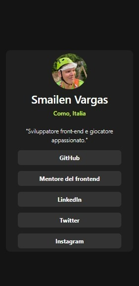
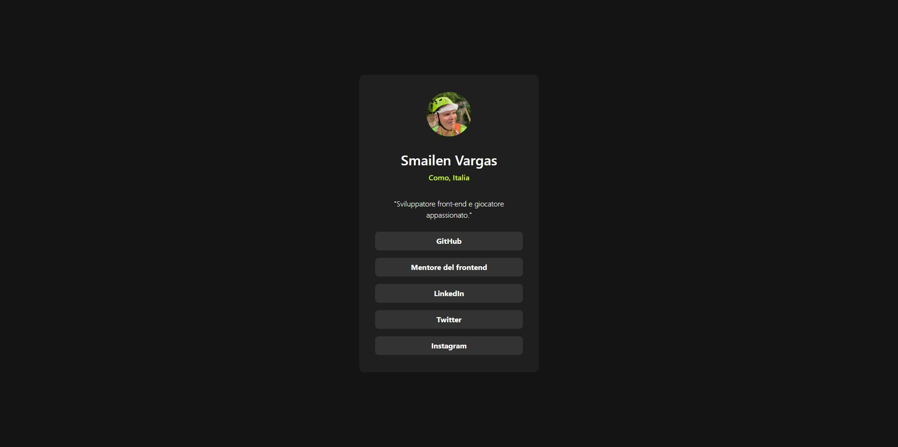
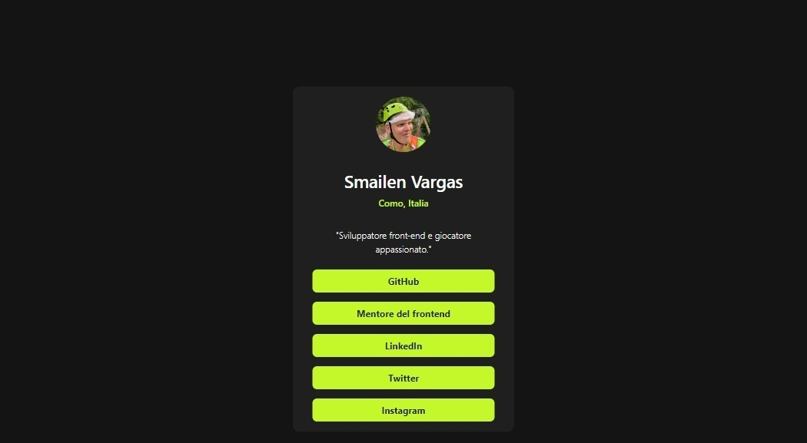

# Frontend Mentor - Social links profile solution

This is a solution to the [Social links profile challenge on Frontend Mentor](https://www.frontendmentor.io/challenges/social-links-profile-UG32l9m6dQ). Frontend Mentor challenges help you improve your coding skills by building realistic projects. 

## Table of contents

- [Overview](#overview)
  - [The challenge](#the-challenge)
  - [Screenshot](#screenshot)
  - [Links](#links)
- [My process](#my-process)
  - [Built with](#built-with)
  - [What I learned](#what-i-learned)
  - [Useful resources](#useful-resources)
- [Author](#author)

## Overview

### The challenge

Users should be able to:

- See hover and focus states for all interactive elements on the page

### Screenshot

### Links

- Solution URL: [Add solution URL here](https://github.com/Smailen5/social-links-profile-main)
- Live Site URL: [Add live site URL here](https://smailen5.github.io/social-links-profile-main/)

## My process

### Built with

- Semantic HTML5 markup
- Flexbox
- Mobile-first workflow
- Tailwind CSS

### What I learned

I've applied what I've learned with Tailwind in my first project, so it's all new to me.

### Useful resources

- [Tailwind documentation](https://tailwindcss.com/docs/hover-focus-and-other-states#hover-focus-and-active) - The only resource I used is the official Tailwind documentation.
- [Where I studied](https://www.youtube.com/playlist?list=PLP5MAKLy8lP9iYl12rUcrYJgKggci5SPn) - I mainly studied following these videos.

## Author

- Github - [Smailen5](https://github.com/Smailen5)
- Frontend Mentor - [@Smailen5](https://www.frontendmentor.io/profile/Smailen5)
- Linkedin - [@smailen-vargas](https://www.linkedin.com/in/smailen-vargas/)